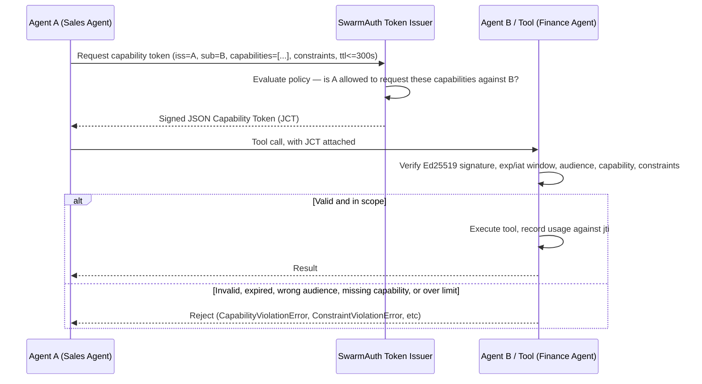

# SwarmAuth

**The zero-trust authorization standard for multi-agent systems.**

SwarmAuth is OAuth 2.1 for autonomous AI swarms: cryptographically signed,
short-lived (≤300s), capability-scoped delegation tokens for agent-to-agent
and agent-to-tool calls. It's built on one assumption you should already
hold — your LLM layer *will* be compromised by prompt injection — and asks a
different question: when that happens, does the execution boundary stop the
damage, or does it just trust whatever the model decided?

Today, most multi-agent stacks pass raw API keys or unscoped bearer tokens
between agents. Read the full threat model and protocol details in
[SPEC.md](SPEC.md).

## Why

- **Prompt injection is not a solved problem, and won't be soon.** SwarmAuth
  doesn't try to detect or prevent it — it makes the LLM's decision
  irrelevant at the point of execution.
- **Capability tokens, not credentials.** A token names exactly what it
  authorizes (`capabilities`), against whom (`sub`), and under what limits
  (`constraints`: rate limits, call caps, budget caps, parameter
  allowlists) — never a raw, reusable key.
- **Tokens expire in seconds.** Max TTL is 300 seconds, enforced by every
  verifier regardless of what an issuer tries to claim.
- **Zero exotic dependencies.** Ed25519 via `cryptography`, schema via
  `pydantic`. That's the whole dependency tree — `KeyRegistry` needs neither,
  and `RedisUsageTracker` is an opt-in extra, not baked into the core.
- **Sub-millisecond verification.** See benchmark results below.
- **Built for more than two agents.** `KeyRegistry` trusts many issuers at
  once and rotates keys without a hard cutover; `RedisUsageTracker`
  enforces rate/budget/call limits atomically across every verifier
  process in the swarm, not just one.

## Quickstart

```python
import swarmauth

finance_keys = swarmauth.KeyPair.generate()

@swarmauth.guard("tool:process_payout", issuer_public_key=finance_keys.public_bytes)
def process_payout(destination_account: str, amount_usd: float):
    ...  # your real tool logic — only ever reached with a verified, in-scope token
```

Issuing a token that will actually pass that check is one line:

```python
token = swarmauth.TokenIssuer(finance_keys).issue(
    iss="agent:sales-agent-01", sub="tool:process_payout",
    capabilities=["tool:process_payout"], ttl_seconds=60,
)
```

That's the entire integration surface: `@swarmauth.guard` the tool, issue the
token. Framework adapters for LangChain, CrewAI, AutoGen, and MCP tools are
one call each — see [`swarmauth/middleware.py`](swarmauth/middleware.py)
(`secure_langchain_tool`, `secure_crewai_tool`, `secure_autogen_function`,
`secure_mcp_tool`), verified against real LangChain, ag2, and MCP installs in
[`tests/test_framework_adapters.py`](tests/test_framework_adapters.py).

## Scaling out: many issuers and many verifier processes

The examples above assume one issuer whose public key a verifier already
has in hand. A real swarm usually has many issuing agents and many verifier
processes, which needs two more pieces:

**`KeyRegistry`** — trust many issuers, and rotate an issuer's key without a
hard cutover ([SPEC.md §8](SPEC.md#8-key-registry-and-rotation)):

```python
from swarmauth.registry import KeyRegistry

registry = KeyRegistry()
registry.register("agent:sales-agent-01", sales_keys.public_bytes)
registry.register("agent:finance-agent-01", finance_keys.public_bytes)

# Rotate sales-agent-01's key later without invalidating in-flight tokens:
registry.register("agent:sales-agent-01", new_sales_keys.public_bytes, rotate=True)
registry.revoke("agent:sales-agent-01", sales_keys.public_bytes)  # once fully rolled over

@swarmauth.guard("tool:process_payout", key_registry=registry)
def process_payout(destination_account: str, amount_usd: float):
    ...
```

**`RedisUsageTracker`** — enforce `max_calls`/`max_amount_usd`/`rate_limit_per_min`
atomically across multiple verifier processes instead of per-process
([SPEC.md §9](SPEC.md#9-distributed-usage-tracking)):

```python
import redis
from swarmauth.backends.redis_backend import RedisUsageTracker

tracker = RedisUsageTracker(redis.Redis.from_url("redis://localhost:6379/0"))

@swarmauth.guard("tool:process_payout", key_registry=registry, tracker=tracker)
def process_payout(destination_account: str, amount_usd: float):
    ...
```

Both are optional and additive: `issuer_public_key=` and the default
in-memory `UsageTracker` still work exactly as in the quickstart above.

## Install

```bash
pip install -e .
# or, without an editable install:
pip install cryptography pydantic
```

(Not yet published to PyPI — this is the MVP/open-source launch. `pip
install -e .` from a clone works today.)

For running the full test suite, including the real-framework adapter tests
and the Redis backend tests (which run against `fakeredis` by default, no
server required):

```bash
pip install -e ".[dev,frameworks,redis]"
pytest
```

## Architecture



Full claims schema, canonicalization rules, and the complete verification
algorithm are in [SPEC.md](SPEC.md).

## SwarmBench: does this actually stop anything?

[`benchmarks/swarmbench.py`](benchmarks/swarmbench.py) runs a runnable
simulation of a Sales Agent that delegates to a Finance Agent's
`process_payout` tool, with a prompt injection embedded in inbound customer
email instructing the Sales Agent to trigger a $50,000 payout to an
attacker-controlled account. The injection is modeled as **succeeding** at
the LLM layer in both test cases — SwarmBench isn't testing whether models
can be fooled (they can); it's testing what happens next.

```bash
python benchmarks/swarmbench.py
```

### Results (from an actual run on this machine)

| Scenario | Injection succeeds at LLM layer | Unauthorized payout executed | Blocked at execution boundary |
|---|---|---|---|
| **Unprotected** agent loop | ✅ Yes | ❌ **Yes — $50,000 sent** | — |
| **SwarmAuth-protected** agent loop | ✅ Yes | ✅ **No** | ✅ Yes (`CapabilityViolationError`) |

| Metric | Value |
|---|---|
| Mean token verification overhead | **0.12 ms/op** (target: <1ms) |

In the unprotected loop, the Finance Agent's tool trusts whatever arguments
it's called with — the injection walks straight through. In the protected
loop, the token the Sales Agent actually holds only grants
`tool:draft_payout` under a policy-set budget; it does not, and cannot,
grant `tool:process_payout` no matter what the compromised LLM decided to
call — so the execution boundary rejects it before the ledger is touched.

## Repository layout

```
swarmauth/
├── SPEC.md                        # protocol specification
├── README.md
├── CONTRIBUTING.md
├── SECURITY.md
├── .github/workflows/ci.yml        # tests + benchmark + live-Redis job on every push/PR
├── swarmauth/
│   ├── __init__.py
│   ├── crypto.py                   # Ed25519 keypairs, signing, verification
│   ├── token.py                     # CapabilityToken: issue / parse / verify
│   ├── registry.py                   # KeyRegistry: multi-issuer trust + key rotation
│   ├── middleware.py                  # guard decorator + framework adapters
│   ├── backends/
│   │   └── redis_backend.py            # RedisUsageTracker (optional `redis` extra)
│   ├── exceptions.py
│   └── py.typed
├── benchmarks/
│   └── swarmbench.py                # runnable unprotected-vs-protected simulation
└── tests/
    ├── test_token.py
    ├── test_middleware.py
    ├── test_registry.py
    ├── test_redis_backend.py         # runs against fakeredis, or a real server in CI
    └── test_framework_adapters.py    # real LangChain, ag2, and MCP integration tests
```

## Design principles

- No cryptographic dependencies beyond `cryptography`; no schema/validation
  dependencies beyond `pydantic`.
- Strict typing, explicit exception hierarchy (`TokenExpiredError`,
  `CapabilityViolationError`, `ConstraintViolationError`, ...) — callers
  decide how to handle each failure mode, nothing fails silently.
- Tokens are data, not infrastructure: no required network call, no
  mandatory central service. Self-issuance and centralized-issuer
  deployments use the exact same token format and verification code.

## Status

MVP / RFC. The token format, claims schema, and verification algorithm are
considered stable for `0.1.x`. Multi-issuer key rotation (`KeyRegistry`,
[SPEC.md §8](SPEC.md#8-key-registry-and-rotation)) and distributed usage
tracking (`RedisUsageTracker`, [SPEC.md §9](SPEC.md#9-distributed-usage-tracking))
now ship in the SDK; expect the framework adapters to keep evolving as more
of them get real integration use. Issues and PRs welcome.

## License

MIT — see [LICENSE](LICENSE).
