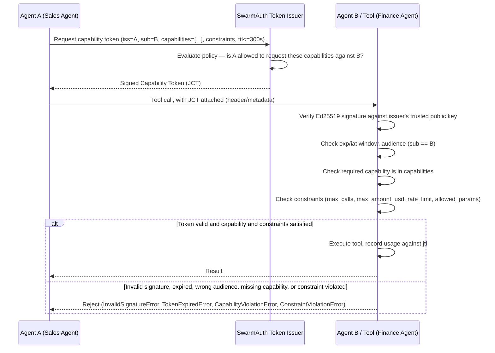

# SwarmAuth Protocol Specification

**Version:** 0.1.0-draft
**Status:** MVP / Request for Comments

## 1. Abstract

SwarmAuth defines a compact, signed **Capability Token** format and a
verification protocol for authorizing one autonomous AI agent (or the tool
it wants to invoke) to act on behalf of another, for a short, bounded window
of time. It is designed for inter-agent and agent-to-tool calls inside
multi-agent ("swarm") systems, where today's common practice — passing raw
API keys, shared secrets, or unscoped bearer tokens between agents — creates
an unbounded blast radius when any one agent is compromised via prompt
injection, jailbreak, or malicious tool output.

SwarmAuth borrows the delegation model of OAuth 2.1 (a token that names an
issuer, an audience, and a scope) but drops everything in OAuth that assumes
a human is present to consent, a long-lived session exists, or a network
round-trip to an authorization server is acceptable on every call. A
Capability Token is self-contained, verifiable offline against a known
public key, and expires in seconds, not hours.

## 2. Threat Model

SwarmAuth assumes:

- **The LLM layer will be compromised.** Prompt injection (via tool output,
  documents, emails, or other agents' messages) can and will cause an agent
  to *decide* to take an unauthorized action. SwarmAuth does not attempt to
  prevent this — no authorization system can fix a model that has been
  convinced to misbehave.
- **The execution boundary must not trust the LLM's decision alone.** The
  point where a tool actually executes (a payment, a database write, a
  privileged API call) is where enforcement must happen, independent of the
  reasoning that led there.
- **Credentials leak.** Long-lived API keys or static shared secrets passed
  between agents are a standing liability: once leaked (via logs, a
  compromised agent, or a malicious dependency) they remain valid until
  manually revoked.
- **Agents are semi-trusted, not fully trusted.** Agent A may legitimately
  need to ask Agent B to do *something* narrow, without being handed
  Agent B's full authority.

SwarmAuth's design response:

| Risk | Mitigation |
|---|---|
| Compromised agent forges unlimited authority | Tokens carry an explicit `capabilities` allowlist; anything not listed is denied by default. |
| Leaked token used after the fact | `exp` is capped at 300 seconds from issuance; leaked tokens self-invalidate quickly. |
| Leaked token replayed rapidly within its lifetime | `constraints.max_calls`, `constraints.rate_limit_per_min`, and `jti`-keyed usage tracking bound repeat use. |
| Confused deputy (token used against the wrong target) | `sub` binds the token to a specific audience; verifiers must check `sub == audience`. |
| Runaway financial/resource impact despite a valid capability | `constraints.max_amount_usd` and `constraints.allowed_params` bound *what* an authorized call can do, not just *that* it's authorized. |
| Forged tokens | Ed25519 signatures over a canonical encoding of the claims; verifiers only trust known, pre-registered public keys. |

SwarmAuth explicitly does **not** solve: prompt injection detection, LLM
output filtering, or network-transport security (use TLS for transport as
you already would).

## 3. Token Structure

A JSON Capability Token (**JCT**) is a compact string of three
base64url segments separated by `.`, structurally similar to a JWS compact
serialization but with a fixed, narrow algorithm and claim set:

```
base64url(header) . base64url(payload) . base64url(signature)
```

### 3.1 Header

```json
{
  "alg": "EdDSA",
  "typ": "JCT",
  "kid": "<base64url-encoded 32-byte Ed25519 public key of the issuer>"
}
```

- `alg` is always `"EdDSA"` (Ed25519). SwarmAuth defines no algorithm
  negotiation — this is deliberate; algorithm agility in token formats is a
  recurring source of vulnerabilities (e.g. `alg: none` attacks).
- `kid` doubles as the issuer's raw public key, so a verifier that already
  trusts that key (via out-of-band registration/policy) needs no separate
  key-discovery step.

### 3.2 Payload (Claims)

| Claim | Type | Required | Description |
|---|---|---|---|
| `iss` | string | yes | Issuer agent ID, e.g. `"agent:sales-agent-01"`. |
| `sub` | string | yes | Target agent or tool ID this token authorizes calling into, e.g. `"tool:process_payout"`. The audience. |
| `capabilities` | string[] | yes, non-empty | Capabilities granted. Exact match (`"tool:read_invoice"`) or a `prefix:*` wildcard (`"tool:*"`). |
| `constraints` | object | no (defaults empty) | See §3.3. |
| `iat` | integer | yes | Issued-at, Unix seconds. |
| `exp` | integer | yes | Expiry, Unix seconds. **`exp - iat` MUST be ≤ 300.** Verifiers reject tokens that violate this even if the signature is valid, to prevent an issuer bug or a compromised issuer from minting long-lived tokens. |
| `jti` | string | yes (auto-generated) | Unique token ID (128-bit, base64url), used as the key for usage-tracking / replay bounds. |

### 3.3 Constraints

```json
{
  "max_calls": 1,
  "max_amount_usd": 1000.0,
  "rate_limit_per_min": 5,
  "allowed_params": { "destination_account": "acct_123" }
}
```

All fields are optional; an absent field means "no limit on that axis." All
present fields are enforced at the execution boundary, not just at
verification time — enforcement requires a stateful usage tracker keyed by
`jti` (see the reference SDK's `UsageTracker`), since fields like
`max_calls` and `rate_limit_per_min` are meaningless against a single
verification in isolation.

### 3.4 Canonicalization

The signature covers `base64url(header) + "." + base64url(payload)` as
ASCII bytes. Header and payload JSON are produced with:

- keys sorted lexicographically,
- no insignificant whitespace (`separators=(",", ":")`),
- `ensure_ascii=True` (non-ASCII escaped, avoiding encoding ambiguity).

Any conforming implementation MUST reproduce byte-identical JSON for the
same claims object, since Ed25519 verification is over these exact bytes.

## 4. Verification Algorithm

Given a token string `T` and an expected audience `A`, a verifier MUST:

1. Split `T` into `header_b64`, `payload_b64`, `sig_b64` on `.`; reject if
   not exactly 3 parts.
2. Base64url-decode and JSON-parse the header and payload; reject on
   failure.
3. Reject unless `header.typ == "JCT"` and `header.alg == "EdDSA"`.
4. Validate the payload against the claims schema (§3.2); reject on
   schema violation (missing/extra/mistyped fields).
5. Look up (or read from `header.kid`, if the deployment's trust model
   allows self-asserted keys) the issuer's Ed25519 public key. **A verifier
   MUST only accept public keys it trusts via out-of-band policy** — JCT's
   `kid` is a convenience for key identification, not a substitute for a
   trust decision.
6. Verify the Ed25519 signature over `header_b64 + "." + payload_b64`.
   Reject on failure.
7. Reject unless `claims.exp - claims.iat <= 300`.
8. Reject unless `claims.iat - leeway <= now <= claims.exp + leeway`
   (`leeway` defaults to 2 seconds, to absorb clock skew).
9. If an audience `A` was supplied, reject unless `claims.sub == A`.
10. Check that the capability required for the attempted action is present
    in `claims.capabilities` (exact or wildcard match); reject otherwise.
11. Check any parameters of the attempted call against
    `claims.constraints.allowed_params`; reject on mismatch.
12. Atomically check and update a `jti`-keyed usage record against
    `max_calls`, `max_amount_usd`, and `rate_limit_per_min`; reject if the
    attempted action would violate any of them.

Steps 1–9 are pure functions of the token and require no state. Steps
10–12 require the verifier's local policy (what capability does *this*
call require?) and, for constraints, a stateful tracker.

## 5. Sequence Diagram



Note that "SwarmAuth Token Issuer" is a role, not necessarily a separate
network service: in a decentralized deployment, Agent A can hold its own
Ed25519 keypair and self-issue tokens, with Agent B's trust in Agent A's
public key (and the capabilities A is allowed to grant) established by
out-of-band policy. In a centralized deployment, a dedicated issuer service
holds the signing key(s) and agents request tokens from it over an
authenticated channel. The JCT format and verification algorithm are
identical either way — SwarmAuth defines the token and the boundary check,
not the topology.

## 6. Capability Naming Convention

Capabilities are opaque strings to the protocol, but the reference SDK and
this spec recommend `namespace:action` (e.g. `tool:process_payout`,
`agent:read_memory`, `db:query`), with an optional trailing `:*` wildcard
segment (`tool:*`) meaning "any action in this namespace." Wildcards should
be granted sparingly — they widen blast radius on token compromise exactly
as an unscoped credential would.

## 7. Error Conditions

Reference SDK exception types (all subclass `SwarmAuthError`):

| Exception | Raised when |
|---|---|
| `MalformedTokenError` | Token isn't 3 valid base64url/JSON segments matching the schema. |
| `InvalidSignatureError` | Ed25519 verification fails. |
| `TokenExpiredError` | `now > exp + leeway`, or `exp - iat > 300`. |
| `TokenNotYetValidError` | `now < iat - leeway`. |
| `AudienceMismatchError` | `sub != audience`. |
| `UnknownIssuerError` | Verifying against a `KeyRegistry` (§8) that has no key registered for `claims.iss` at all. |
| `CapabilityViolationError` | Required capability not in `capabilities`. |
| `ConstraintViolationError` | `max_calls`, `max_amount_usd`, `rate_limit_per_min`, or `allowed_params` would be violated. |

## 8. Key Registry and Rotation

Step 5 of the verification algorithm (§4) says a verifier "looks up ... the
issuer's Ed25519 public key" and must only trust keys it accepts via
out-of-band policy. The reference SDK's `swarmauth.registry.KeyRegistry`
implements that policy store for the common case of many issuing agents:

- **Multi-issuer**: `keys_for(iss)` returns the trusted key(s) for a
  specific `iss`, so one verifier can trust many issuing agents without a
  separate `issuer_public_key=` per call.
- **Rotation without a hard cutover**: `register(iss, new_key, rotate=True)`
  adds `new_key` ahead of an issuer's existing key(s) rather than replacing
  them, so both the pre- and post-rotation key verify during a rollover
  window. `CapabilityToken.verify(token, key_registry=...)` tries every
  trusted key for `claims.iss` and accepts the first that verifies.
- **Revocation**: `revoke(iss, key)` (a single compromised key) or
  `revoke_issuer(iss)` (every key for that agent) take effect immediately
  for the next verification — there is no propagation delay because the
  registry is the verifier's own trust store, not a remote lookup.
- **Unknown issuer is distinct from a bad signature.** If no key was ever
  registered for `claims.iss`, verification raises `UnknownIssuerError`
  before any signature check runs, rather than `InvalidSignatureError` --
  this is a policy/registration gap (this verifier has no opinion about that
  issuer), not evidence of a forged token.

A verifier calls `CapabilityToken.verify(token, key_registry=...)` in place
of `issuer_public_key=...` (exactly one of the two is required); `swarmauth.
guard(...)` and `verify_and_check(...)` accept the same substitution.

## 9. Distributed Usage Tracking

Constraint enforcement for `max_calls`, `max_amount_usd`, and
`rate_limit_per_min` (§3.3) requires state keyed by `jti` — meaningless
against a single verification in isolation. The reference SDK ships two
interchangeable trackers behind the same `check_and_record(claims, *,
amount=0.0)` shape:

- `swarmauth.middleware.UsageTracker` — in-memory, process-local. Correct
  for a single verifier process; the zero-dependency default.
- `swarmauth.backends.redis_backend.RedisUsageTracker` — the same
  constraint logic enforced atomically across multiple verifier processes
  or machines sharing one Redis instance, using optimistic-locking
  WATCH/MULTI/EXEC (not a Lua script, so its behavior is auditable in plain
  Python). State is keyed by `jti` under a TTL equal to the token's own
  maximum lifetime plus a small buffer — since a JCT can never legitimately
  be presented again after its own `exp`, there is never a reason to query
  its usage after that window, so Redis expiring the key is both correct
  and avoids unbounded key growth. Requires the optional `redis` extra
  (`pip install swarmauth[redis]`); it is never imported by
  `swarmauth.middleware` unless a caller explicitly imports it.

Any backend satisfying the same `check_and_record` shape may be substituted;
the protocol does not mandate Redis specifically, only that constraint
enforcement be atomic wherever more than one process can verify tokens
against the same `jti`.

## 10. Security Considerations

- **300-second ceiling is a protocol invariant, not a default.** A verifier
  MUST reject any token where `exp - iat > 300`, even if that token carries
  a valid signature — this bounds the damage from an issuer that is
  tricked, buggy, or compromised into minting an unusually long-lived token.
- **No refresh tokens, no long-lived sessions.** Each delegated action gets
  its own token. This trades a small amount of issuance overhead for a hard
  ceiling on exposure window; given the sub-millisecond cost of Ed25519
  signing/verification, this trade is intentional.
- **Wildcards and broad `allowed_params`-free budgets should be treated as
  privileged grants** and audited like any other broad credential.
- **The in-memory `UsageTracker` is process-local by default.** A single
  process is exactly right for the two-agent examples in this spec; a
  deployment with multiple verifier processes or machines enforcing the
  same constraints against the same `jti` should use
  `RedisUsageTracker` (§9) or an equivalent atomic backend instead — the
  short token TTL bounds the damage of accidentally using the in-memory one
  in that setting to a single token's lifetime, but it will still
  under-enforce `max_calls`/`rate_limit_per_min` across processes.
- **Transport security is out of scope** — SwarmAuth assumes TLS (or
  equivalent) between agents; JCT integrity/authenticity is orthogonal to,
  and does not replace, transport confidentiality.
- **Key distribution is a deployment concern; revocation is not.** SwarmAuth
  does not mandate a specific PKI for how a `KeyRegistry` (§8) initially
  learns an issuer's public key — that's out-of-band policy, same as before.
  But once registered, rotation and revocation are immediate and in-process
  via the registry itself (§8), not a "deployment concern" left unsolved:
  `kid` remains a hint for key identification, never a trust root, and a
  verifier's `KeyRegistry` is the actual trust root.

## 11. Versioning

This is `0.1.0-draft`, the MVP surface. Backwards-incompatible changes to
the header/claims schema will bump the `typ` value away from `"JCT"` (or
introduce a versioned successor, e.g. `"JCT2"`) so that old and new
verifiers never silently misinterpret each other's tokens.
